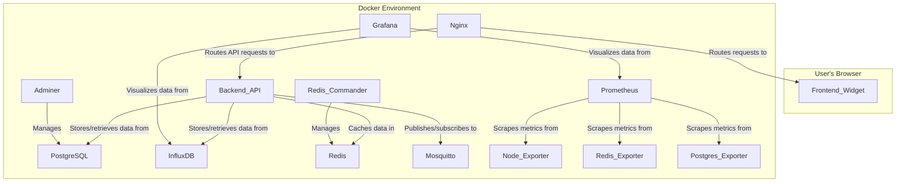

# Audit Report: Real-Time Localhost Monitoring System

## 1. Executive Summary of Findings

This report provides a comprehensive audit of the Real-Time Localhost Monitoring System. The system is designed to provide real-time monitoring of a localhost environment, complete with a frontend widget and backend API.

Key features of the system include:
- **Real-Time Monitoring:** CPU usage, memory management, disk monitoring, network analytics, and service status.
- **Advanced Configuration:** Customizable refresh intervals, themes, and metric selection.
- **Analytics & Reporting:** Historical data tracking, chart visualizations, and data export.
- **Intelligent Alerting:** Threshold-based alerts and log analysis.
- **Modern UI/UX:** A responsive and interactive widget for data visualization.

The system is architecturally divided into a frontend application and a backend API. The backend exposes a RESTful API for retrieving monitoring data and managing system configuration. The frontend consumes this API to provide a user-friendly monitoring dashboard.

This audit will delve into the system's architecture, components, APIs, and security posture, providing recommendations for improvement and highlighting potential risks.

## 2. Detailed Architecture Diagrams

The monitoring system is a multi-container Docker application orchestrated by `docker-compose`. The architecture is composed of several key services that work in concert to provide a comprehensive monitoring solution.

### Services Overview

- **Data Tier:**
  - **PostgreSQL:** A relational database for structured data.
  - **InfluxDB:** A time-series database for storing performance metrics.
  - **Redis:** An in-memory data store for caching and session management.

- **Backend Tier:**
  - **Backend API:** A Node.js application that provides the core API for the monitoring system.
  - **Mosquitto:** An MQTT broker for real-time communication.
  - **Prometheus:** A metrics collection and alerting system.
  - **Exporters:** `node-exporter`, `redis-exporter`, and `postgres-exporter` provide metrics to Prometheus.

- **Frontend Tier:**
  - **Frontend Widget:** A React-based single-page application that provides the user interface for the monitoring system.

- **Management & Visualization Tier:**
  - **Grafana:** A data visualization and monitoring platform, likely used for creating dashboards from the data in InfluxDB and Prometheus.
  - **Adminer:** A web-based database management tool for PostgreSQL.
  - **Redis Commander:** A web-based management tool for Redis.

- **Networking Tier:**
  - **Nginx:** A reverse proxy that routes traffic to the appropriate services.

### Architecture Diagram



## 3. Component Hierarchy and Data Flow Charts

### Frontend Component Hierarchy

The frontend application is built with React and follows a component-based architecture. The component hierarchy is organized as follows:

```
src/
├── app/           # Redux store and hooks
├── components/    # Reusable UI components
│   ├── Globe.jsx
│   ├── DataPanel.jsx
│   ├── Gauge.jsx
│   └── ...
├── features/      # Application features (e.g., chat)
│   └── ...
├── layouts/       # Layout components
│   └── DashboardLayout.jsx
├── hooks/         # Custom React hooks
├── ...
└── App.jsx        # Main application component
```

**Key Components:**

- **`App.jsx`**: The root component of the application.
- **`DashboardLayout.jsx`**: The main layout for the monitoring dashboard.
- **`DataPanel.jsx`**: A component for displaying data, likely used for metrics.
- **`Gauge.jsx`**: A gauge component for visualizing metrics like CPU and memory usage.
- **`Globe.jsx`**: A component that displays a globe, which might be used for visualizing network data.

### Frontend Data Flow

The frontend application uses a unidirectional data flow pattern, which is typical for React applications using Redux. The data flow can be summarized as follows:

1.  **API Interaction:** The application fetches data from the backend API using Redux async thunks or a similar mechanism.
2.  **Redux Store:** The fetched data is stored in the Redux store.
3.  **Component Rendering:** React components subscribe to the Redux store and re-render when the data changes.
4.  **User Interaction:** User interactions trigger actions that are dispatched to the Redux store, which may in turn trigger new API requests.

### Backend Data Flow

The backend is a Node.js application that serves as the API for the frontend. Based on the `MONITORING_SYSTEM.md` file, the backend's data flow is as follows:

1.  **API Endpoints:** The backend exposes a RESTful API with endpoints for retrieving system metrics, service status, logs, alerts, and configuration.
2.  **Data Sources:** The backend retrieves data from various sources:
    -   **System Metrics:** The backend likely uses a library like `systeminformation` to gather real-time data on CPU, memory, and disk usage.
    -   **Service Status:** The backend checks the health of the services defined in `docker-compose.yml`.
    -   **Logs:** The backend can retrieve logs, likely from the Docker containers or from log files.
    -   **Alerts:** The backend generates alerts based on predefined rules.
    -   **Configuration:** The backend manages the system's configuration.
3.  **Data Storage:** The backend stores data in the following databases:
    -   **PostgreSQL:** For structured data, such as configuration and possibly historical data.
    -   **InfluxDB:** For time-series data, such as system metrics.
4.  **Real-time Communication:** The backend uses WebSockets or MQTT for real-time communication with the frontend.

## 4. API Endpoint Documentation

The backend provides a RESTful API for monitoring and managing the system. The following is a summary of the available endpoints, as documented in `MONITORING_SYSTEM.md`.

### `/api/monitoring/metrics`

-   **Method:** `GET`
-   **Description:** Retrieves real-time system metrics.

### `/api/monitoring/services`

-   **Method:** `GET`
-   **Description:** Retrieves the status of the monitored services.

### `/api/monitoring/logs`

-   **Method:** `GET`
-   **Description:** Retrieves system logs.
-   **Query Parameters:**
    -   `level`: Filter by log level (e.g., `info`, `warning`, `error`).
    -   `limit`: The maximum number of log entries to return.

### `/api/monitoring/config`

-   **Method:** `GET`
-   **Description:** Retrieves the current system configuration.

-   **Method:** `PUT`
-   **Description:** Updates the system configuration.

### `/api/monitoring/export`

-   **Method:** `GET`
-   **Description:** Exports monitoring data.
-   **Query Parameters:**
    -   `format`: The format of the export (e.g., `json`, `csv`).

### `/api/monitoring/report`

-   **Method:** `POST`
-   **Description:** Generates a monitoring report.

## 5. WebSocket/MQTT Event Catalog

The system utilizes WebSockets and/or MQTT for real-time communication between the backend and the frontend. While a specific event catalog is not provided in the documentation, the following events can be inferred based on the system's functionality:

### System Metrics Events

-   **`metrics:cpu`**: Transmits real-time CPU usage data.
-   **`metrics:memory`**: Transmits real-time memory usage data.
-   **`metrics:disk`**: Transmits real-time disk usage data.
-   **`metrics:network`**: Transmits real-time network usage data.

### Service Status Events

-   **`services:status`**: Transmits updates on the status of monitored services (e.g., `online`, `offline`).

### Alert Events

-   **`alerts:new`**: Notifies the frontend of a new alert.
-   **`alerts:update`**: Transmits updates to existing alerts.
-   **`alerts:resolve`**: Notifies the frontend that an alert has been resolved.

## 6. Environment Setup Guide

The following steps are required to set up the development environment for the Real-Time Localhost Monitoring System:

1.  **Prerequisites:**
    -   Node.js and npm
    -   Docker and Docker Compose

2.  **Installation:**
    -   Clone the repository.
    -   Run `npm install` in the root directory to install all dependencies.

3.  **Configuration:**
    -   Create a `.env` file in the root directory, based on the `.env.example` file.
    -   Update the `.env` file with the required secrets and configuration values.

4.  **Running the Application:**
    -   Run `npm run dev` to start the frontend and backend services.
    -   Alternatively, you can run the services individually with `npm run start:frontend` and `npm run start:backend`.

5.  **Accessing the Application:**
    -   The frontend is available at `http://localhost:5173`.
    -   The backend is available at `http://localhost:3001`.

## 7. Recommendations for UI Wireframing/Prototyping

The current UI is functional, but could be improved with the following recommendations:

-   **Dashboard Customization:** Allow users to customize the layout of the dashboard by adding, removing, and rearranging widgets.
-   **Interactive Charts:** Make the charts more interactive by allowing users to zoom, pan, and select specific data points.
-   **Improved Alerting UI:** Provide a more detailed and user-friendly interface for viewing and managing alerts.
-   **Mobile-First Design:** While the current UI is responsive, a mobile-first approach would ensure a better experience on smaller screens.

## 8. Prioritized List of Improvements

The following is a prioritized list of improvements for the Real-Time Localhost Monitoring System:

### High Priority

-   **Implement the backend:** The backend `index.js` file is currently empty. The first priority should be to implement the backend API.
-   **Flesh out the WebSocket/MQTT implementation:** The documentation mentions WebSockets and MQTT, but the implementation details are missing. This should be a high priority to enable real-time functionality.
-   **Add authentication and authorization:** The system currently lacks any form of authentication or authorization, which is a major security risk.

### Medium Priority

-   **Improve the UI/UX:** The UI could be improved with the recommendations mentioned in the previous section.
-   **Add more monitoring metrics:** The system could be enhanced by adding more monitoring metrics, such as GPU usage, container-level metrics, and application-specific metrics.
-   **Expand the alerting capabilities:** The alerting system could be improved by adding support for more notification channels (e.g., email, Slack) and more complex alert rules.

### Low Priority

-   **Add a plugin system:** A plugin system would allow users to extend the functionality of the monitoring system with custom metrics and features.
-   **Add support for more data sources:** The system could be extended to support more data sources, such as other time-series databases and logging systems.

-   **Perform Regular Security Audits:** Regularly audit the system for security vulnerabilities and address any issues that are found.

## 10. UI Wireframe

A wireframe for the main dashboard has been created in `packages/frontend/src/components/DashboardWireframe.jsx`. This wireframe provides a basic layout for the dashboard, including a sidebar, a main content area, and several data panels. This wireframe can be used as a starting point for the final UI design.

### Wireframe Code

```jsx
import React from 'react';
import { Gauge } from './Gauge';
import { DataPanel } from './DataPanel';
import { Globe } from './Globe';

const DashboardWireframe = () => {
  return (
    <div className="flex h-screen bg-gray-900 text-white">
      {/* Sidebar */}
      <div className="w-64 bg-gray-800 p-4">
        <h1 className="text-2xl font-bold mb-4">Dashboard</h1>
        <nav>
          <ul>
            <li className="mb-2"><a href="#" className="hover:text-gray-300">Overview</a></li>
            <li className="mb-2"><a href="#" className="hover:text-gray-300">Metrics</a></li>
            <li className="mb-2"><a href="#" className="hover:text-gray-300">Services</a></li>
            <li className="mb-2"><a href="#" className="hover:text-gray-300">Alerts</a></li>
            <li className="mb-2"><a href="#" className="hover:text-gray-300">Settings</a></li>
          </ul>
        </nav>
      </div>

      {/* Main Content */}
      <div className="flex-1 p-4">
        <div className="grid grid-cols-1 md:grid-cols-2 lg:grid-cols-3 gap-4">
          {/* Gauges */}
          <DataPanel title="CPU Usage">
            <Gauge value={65} />
          </DataPanel>
          <DataPanel title="Memory Usage">
            <Gauge value={80} />
          </DataPanel>
          <DataPanel title="Disk Usage">
            <Gauge value={45} />
          </DataPanel>

          {/* Globe */}
          <div className="col-span-1 md:col-span-2 lg:col-span-3">
            <DataPanel title="Network Visualization">
              <Globe />
            </DataPanel>
          </div>
        </div>
      </div>
    </div>
  );
};

export default DashboardWireframe;
```
